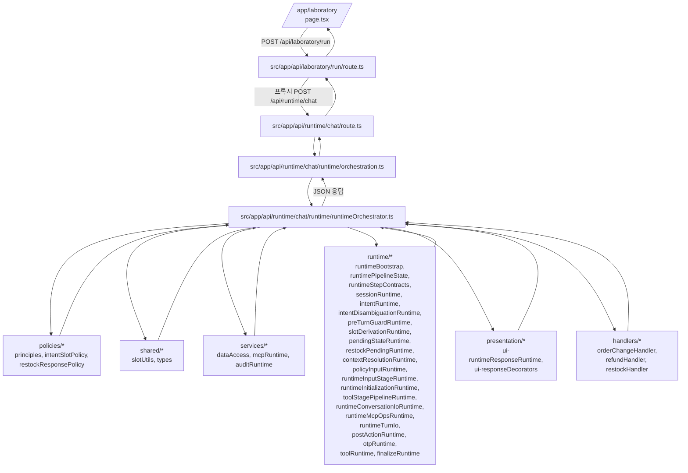

# Runtime Chat/Restock 동작 통합 명세 (한글)

본 문서는 아래 파일들에 구현된 런타임 동작을 한 곳에 정리한 운영/개발 문서입니다.

- `src/app/api/runtime/chat/core.ts`
- `src/app/api/runtime/chat/runtime/orchestration.ts`
- `src/app/api/runtime/chat/runtime/runtimeOrchestrator.ts`
- `src/app/api/runtime/chat/runtime/runtimeEngine.ts`
- `src/app/api/runtime/chat/runtime/runtimeSupport.ts`
- `src/app/api/runtime/chat/runtime/quickReplyConfigRuntime.ts`
- `src/app/api/runtime/chat/runtime/promptTemplateRuntime.ts`
- `src/app/api/runtime/chat/presentation/ui-responseDecorators.ts`
- `src/app/api/runtime/chat/runtime/sessionRuntime.ts`
- `src/app/api/runtime/chat/runtime/intentRuntime.ts`
- `src/app/api/runtime/chat/runtime/otpRuntime.ts`
- `src/app/api/runtime/chat/runtime/toolRuntime.ts`
- `src/app/api/runtime/chat/runtime/finalizeRuntime.ts`
- `src/app/api/runtime/chat/runtime/postToolRuntime.ts`
- `src/app/api/runtime/chat/runtime/errorRuntime.ts`
- `src/app/api/runtime/chat/runtime/intentDisambiguationRuntime.ts`
- `src/app/api/runtime/chat/runtime/postActionRuntime.ts`
- `src/app/api/runtime/chat/runtime/preTurnGuardRuntime.ts`
- `src/app/api/runtime/chat/runtime/slotDerivationRuntime.ts`
- `src/app/api/runtime/chat/runtime/pendingStateRuntime.ts`
- `src/app/api/runtime/chat/runtime/restockPendingRuntime.ts`
- `src/app/api/runtime/chat/runtime/contextResolutionRuntime.ts`
- `src/app/api/runtime/chat/runtime/runtimeTurnIo.ts`
- `src/app/api/runtime/chat/runtime/runtimeBootstrap.ts`
- `src/app/api/runtime/chat/runtime/runtimePipelineState.ts`
- `src/app/api/runtime/chat/runtime/runtimeStepContracts.ts`
- `src/app/api/runtime/chat/runtime/policyInputRuntime.ts`
- `src/app/api/runtime/chat/runtime/toolStagePipelineRuntime.ts`
- `src/app/api/runtime/chat/runtime/runtimeConversationIoRuntime.ts`
- `src/app/api/runtime/chat/runtime/runtimeMcpOpsRuntime.ts`
- `src/app/api/runtime/chat/runtime/runtimeInputStageRuntime.ts`
- `src/app/api/runtime/chat/runtime/runtimeInitializationRuntime.ts`
- `src/app/api/runtime/chat/presentation/ui-runtimeResponseRuntime.ts`
- `src/app/api/runtime/chat/presentation/runtimeResponseSchema.ts`
- `src/app/api/runtime/chat/handlers/refundHandler.ts`
- `src/app/api/runtime/chat/handlers/orderChangeHandler.ts`
- `src/app/api/runtime/chat/handlers/restockHandler.ts`
- `src/app/api/runtime/chat/route.ts`
- `src/app/api/runtime/chat/policies/principles.ts`
- `src/app/api/runtime/chat/policies/intentSlotPolicy.ts`
- `src/app/api/runtime/chat/shared/slotUtils.ts`
- `src/app/api/runtime/chat/shared/types.ts`
- `src/app/api/runtime/chat/services/dataAccess.ts`
- `src/app/api/runtime/chat/services/mcpRuntime.ts`
- `src/app/api/runtime/chat/services/auditRuntime.ts`
- `src/app/api/runtime/chat/policies/restockResponsePolicy.ts`
- `src/app/api/runtime/restock/dispatch/route.ts`

---

## 1. 전체 구조 요약

- `chat/core.ts`는 하위 호환용 얇은 엔트리 파일로, `POST`를 `chat/runtime/orchestration.ts`에서 재-export 합니다.
- `chat/route.ts`는 Next.js API 라우팅 엔트리 파일입니다.
- `chat/runtime/orchestration.ts`는 얇은 오케스트레이터로서 엔트리/조합만 담당합니다.
- `chat/runtime/runtimeOrchestrator.ts`가 실제 상담 엔진(인증, 세션, 의도/슬롯 추출, 정책 게이트, 단계 위임, 확정 응답, 감사 로그)을 수행합니다.
- `chat/runtime/runtimeEngine.ts`는 하위 호환 shim으로 `runtimeOrchestrator.ts`를 재-export 합니다.
- `chat/runtime/runtimeSupport.ts`는 runtime 공통 보조 유틸(디버그 prefix 구성, 실패 payload, timing stage, 날짜 유틸)을 제공합니다.
- `chat/presentation/ui-responseDecorators.ts`는 quick reply 자동 파생과 선택형 응답 HTML 렌더링을 담당합니다.
- `chat/runtime/quickReplyConfigRuntime.ts`는 quick reply 선택 규칙(min/max/mode/submit/source)을 중앙 결정합니다.
- `chat/runtime/promptTemplateRuntime.ts`는 확인/선택 프롬프트 문구를 중앙 결정하고 `bot_context/entity` override를 지원합니다.
  - 오케스트레이터 시작 시 `compiledPolicy.templates`를 runtime template override로 자동 매핑합니다.
  - 재입고 리드데이 선택 프롬프트도 템플릿 키 기반으로 구성됩니다.
- `chat/runtime/sessionRuntime.ts`는 세션 생성/재사용 및 최근 턴 로딩 공통 처리를 담당합니다.
- `chat/runtime/intentRuntime.ts`는 expected input/재입고 구독 stage 판별 공통 처리를 담당합니다.
- `chat/runtime/otpRuntime.ts`는 OTP pending/stage/ref 상태 읽기 공통 처리를 담당합니다.
- `chat/runtime/toolRuntime.ts`는 도구 접근 평가 및 forced tool call 필터 공통 처리를 담당합니다.
- `chat/runtime/toolStagePipelineRuntime.ts`는 tool gate 평가 → forced/filter/실행 → post-tool 분기를 하나의 단계로 조합합니다.
- `chat/runtime/runtimeConversationIoRuntime.ts`는 debug snapshot을 포함한 `makeReply`/`insertTurn` 생성 래퍼를 제공합니다.
- `chat/runtime/runtimeMcpOpsRuntime.ts`는 MCP 추적 상태 업데이트와 skip 감사 flush를 조합한 실행 헬퍼를 제공합니다.
- `chat/runtime/runtimeInputStageRuntime.ts`는 input 정책 단계(intent 보정/충돌 이벤트/slot 추출 이벤트/forced input 응답)를 통합 위임합니다.
- `chat/runtime/runtimeInitializationRuntime.ts`는 이전 턴/슬롯 seed 계산과 `RuntimePipelineState` 초기화를 담당합니다.
- `chat/presentation/ui-runtimeResponseRuntime.ts`는 공통 API 응답(타이밍 로그/quick reply/rich html)을 담당합니다.
- `chat/presentation/runtimeResponseSchema.ts`는 `response_schema` 타입/구성/검증(`validateRuntimeResponseSchema`)을 담당합니다.
- `chat/runtime/finalizeRuntime.ts`는 final LLM 메시지 구성, general guard, 최종 저장/응답 처리를 담당합니다.
- `chat/runtime/postToolRuntime.ts`는 tool 실행 후 결정론 분기(주문선택/주문조회 가드/후속 handler 연결)를 담당합니다.
- `chat/runtime/errorRuntime.ts`는 런타임 예외 fallback 응답/감사 저장 처리를 담당합니다.
- `chat/runtime/intentDisambiguationRuntime.ts`는 의도 다중 후보 선택 흐름(intent queue/선택 응답/이벤트 기록)을 담당합니다.
- `chat/runtime/postActionRuntime.ts`는 상담 종료 후 CSAT 선택/사유 수집 단계 상태머신을 담당합니다.
- `chat/runtime/preTurnGuardRuntime.ts`는 대화 종료/휴대폰 재사용 확인 등 선행 가드 분기를 담당합니다.
- `chat/runtime/slotDerivationRuntime.ts`는 expected input 기반 슬롯 파생과 보조 LLM 엔티티 추출 보강을 담당합니다.
- `chat/runtime/pendingStateRuntime.ts`는 address/change/refund pending 상태 분기와 해당 확인 응답 흐름을 담당합니다.
- `chat/runtime/restockPendingRuntime.ts`는 restock subscribe pending 상태(stage별 확인/종료/선택 처리) 분기를 담당합니다.
- `chat/runtime/contextResolutionRuntime.ts`는 의도 seed + order/zipcode 오염 방지 + policy context 구성 단계를 담당합니다.
- `chat/runtime/runtimeTurnIo.ts`는 `makeReply` 디버그 prefix 구성과 `insertTurn` 저장 래퍼를 담당합니다.
- `chat/runtime/runtimeBootstrap.ts`는 인증/요청 파싱/에이전트·KB·정책·허용 도구·세션 초기화를 담당합니다.
- `chat/runtime/runtimePipelineState.ts`는 런타임 단계 간 공유되는 가변 상태 타입/초기화 규약을 제공합니다.
- `chat/runtime/runtimeStepContracts.ts`는 단계 입출력 타입(`RuntimeStepInput/Output`) 표준화를 제공하며, pre-turn/OTP/tool/post-tool 출력 계약을 점진 적용합니다.
- `chat/runtime/toolRuntime.ts`는 도구 실행 외에도 pre-MCP 결정 이벤트/정책 충돌 이벤트/skip 감사 flush를 지원합니다.
- `chat/runtime/policyInputRuntime.ts`는 input 정책 단계의 의도 보정/충돌 기록/슬롯 추출 이벤트/강제응답 처리 위임을 담당합니다.
- `chat/handlers/restockHandler.ts`는 restock inquiry/subscribe 대형 의도 분기를 분리한 핸들러입니다.
- `chat/policies/principles.ts`는 "대원칙" 상수/헬퍼를 제공해, 민감 작업 OTP 보호 및 유일/선택형 답변 정책을 중앙화합니다.
- `chat/policies/intentSlotPolicy.ts`는 의도/슬롯 정책 핵심 함수(의도 분류, 확인/선택형 판별, 재입고 선택 처리 관련 정책 함수)를 모듈화한 파일입니다.
- `chat/shared/slotUtils.ts`는 슬롯 추출/정규화/검증(주문번호, 전화번호, 주소, 우편번호, 선택 인덱스)과 주문 조회 payload 보조 함수를 분리한 파일입니다.
- `chat/shared/types.ts`는 모듈 간 공유 타입(`AgentRow`, `KbRow`, `ProductAliasRow`, `ProductDecision` 등)을 분리한 파일입니다.
- `chat/services/dataAccess.ts`는 에이전트/KB/세션/최근턴 조회와 관리자 KB 그룹 매칭, 상품 정책 판정 조회를 분리한 파일입니다.
- `chat/services/mcpRuntime.ts`는 MCP 도구 실행/감사 로깅 및 주소 검색 fallback 실행 코드를 분리한 파일입니다.
- `chat/services/auditRuntime.ts`는 이벤트/턴 저장(audit/turn spec upsert) 로직을 분리한 파일입니다.
- `chat/policies/restockResponsePolicy.ts`는 재입고/응답 생성 관련 정책 함수(재입고 KB 파싱/랭킹, 안내문 생성, 엔티티 추출 보조)를 분리한 파일입니다.
- `restock/dispatch/route.ts`는 재입고 예약 알림 큐를 읽어 SMS를 발송하는 cron 성격의 배치 엔드포인트입니다.

---

## 1.1 `/app/laboratory` 시작 기준 런타임 수신/분배 흐름

일반적인 대화 시작 경로(실험실 UI 기준)는 아래와 같습니다.

핵심 이해 포인트:
- `/app/laboratory`는 직접 `/api/runtime/chat`를 치지 않고, 먼저 `api/laboratory/run` 프록시를 거칩니다.
- `api/runtime/chat` 진입 후에는 `route.ts -> runtime/orchestration.ts -> runtime/runtimeOrchestrator.ts` 순으로 들어갑니다.
- 실제 분기/정책/도구/저장은 `runtimeOrchestrator.ts`가 수행하고, 세부 구현은 `handlers`, `services`, `runtime`, `policies`, `shared`로 분산 호출합니다.
- 최근 분리 기준으로 `runtimeOrchestrator.ts`는 의도 모호성 분기(`intentDisambiguationRuntime`)와 post-action CSAT 단계(`postActionRuntime`)를 위임 호출합니다.

---

## 2. `chat/policies/principles.ts` (대원칙)

### 2.1 Safety 대원칙

- OTP 필수 intent
  - `order_change`
  - `shipping_inquiry`
  - `refund_request`
- OTP 필수 tool
  - `find_customer_by_phone`
  - `list_orders`
  - `lookup_order`
  - `track_shipment`
  - `update_order_shipping_address`

### 2.2 응답 형태 대원칙

- 유일 답변 기준: `uniqueAnswerCount = 1`
- 선택형 답변 기준: `choiceAnswerMinCount = 2`
- 미리보기 제한
  - 주문 프리뷰 최대: `orderLookupPreviewMax = 3`
  - 선택지 프리뷰 최대: `choicePreviewMax = 5`
  - quick reply 최대: `quickReplyMax = 9`

### 2.3 제공 헬퍼

- `requiresOtpForIntent(intent)`
- `isOtpRequiredTool(toolName)`
- `hasUniqueAnswerCandidate(count)`
- `hasChoiceAnswerCandidates(count)`

---

## 3. `chat/route.ts`

- 구현: `export { POST } from "./core";`
- 역할: Next.js API 라우팅 엔트리 분리

---

## 4. `chat/core.ts`

- 구현: `export { POST } from "./runtime/orchestration";`
- 역할: 이전 대형 로직 파일을 대체하는 얇은 진입/호환 레이어
- 의도: 라우팅/엔트리를 유지하면서 실제 오케스트레이션 코드를 분리

---

## 5. `chat/policies/intentSlotPolicy.ts`

- 역할: `## 11.3 의도/슬롯 정책`에 해당하는 핵심 정책 코드를 분리한 모듈
- 포함 함수(대표): `detectIntent`, `detectIntentCandidates`, `isYesText`, `isNoText`, `parseIndexedChoice`, `availableRestockLeadDays`
- 특징: 오케스트레이션은 정책 함수를 import만 하고, 정책 자체는 본 파일에서 단일 관리

---

## 6. `chat/shared/slotUtils.ts`

- 역할: 슬롯 관련 정책/파서 구현의 단일 모듈
- 포함 함수(대표): `extractOrderId`, `extractPhone`, `extractZipcode`, `extractAddress`, `isLikelyOrderId`, `splitAddressForUpdate`
- 특징: 오케스트레이션의 대형 상태머신에서 슬롯 처리 구현을 분리하여 가독성과 테스트 가능성을 높임

---

## 7. `chat/runtime/orchestration.ts`

- 역할: 아주 얇은 오케스트레이터 엔트리
- 내용: 요청을 받아 `runtimeOrchestrator.ts`의 `POST`로 위임
- 의도: 오케스트레이션 레이어를 짧고 직관적으로 유지

---

## 8. `chat/services/dataAccess.ts`

- 역할: DB 조회/세션 생성/정책 판정 조회를 분리한 데이터 접근 모듈
- 포함 함수(대표): `fetchAgent`, `fetchKb`, `fetchAdminKbs`, `createSession`, `getRecentTurns`, `resolveProductDecision`, `matchesAdminGroup`

---

## 9. `chat/services/mcpRuntime.ts`

- 역할: MCP 도구 실행 게이트웨이 및 주소 검색 fallback 런타임
- 포함 함수(대표): `callMcpTool`, `callAddressSearchWithAudit`, `buildAddressSearchKeywords`

---

## 10. `chat/services/auditRuntime.ts`

- 역할: 이벤트 기록/최종 턴 저장/디버그 스펙 upsert를 담당하는 감사 저장 모듈
- 포함 함수(대표): `insertEvent`, `insertFinalTurn`, `upsertDebugLog`

---

## 11. `chat/runtime/runtimeOrchestrator.ts` 상세

## 11.1 입력/출력 계약

### 11.1.1 요청 Body

- `agent_id?`, `message?`, `session_id?`
- `llm?`: `chatgpt | gemini`
- `kb_id?`, `admin_kb_ids?`
- `mcp_tool_ids?`, `mcp_provider_keys?`
- `mode?`: `natural` 또는 기본 `mk2`

### 11.1.2 공통 응답 필드

- `session_id`, `step`, `message`
- `mcp_actions`
- 자동 부가
  - `trace_id`
  - `turn_id`
  - `quick_replies`(자동 추론 또는 명시값)
  - `rich_message_html`(선택형 목록 메시지의 HTML 렌더)

## 11.2 런타임 파이프라인

1) 인증 컨텍스트 획득 (`getServerContext`)
- 실패 시 401

2) 입력 파싱
- `message` 필수
- `agent_id`가 없으면 `llm/kb/tool` 오버라이드 모드 허용

3) 에이전트/KB/관리자KB 로드
- `B_bot_agents`, `B_bot_knowledge_bases`
- 관리자 KB는 그룹 조건(`apply_groups`)으로 필터

4) 정책 컴파일
- 관리자 KB의 `content_json`들을 `compilePolicy`로 컴파일

5) 허용 도구 계산
- `C_mcp_tools`에서 UUID ID 또는 provider key 기반 확장
- legacy scope(`scope_mall_*`) 보정 확장 지원
- `allowedToolNames`, `allowedToolByName`, `allowedToolIdByName` 구성

6) 세션/턴 로딩
- `D_conv_sessions` 생성 또는 재사용
- 최근 턴(최대 15) 로딩 후 `bot_context` 복원

7) 슬롯 추출/보정
- 채널/주문번호/전화/우편번호/주소 정규식 추출
- 상황별 `expectedInput` 모드 적용(otp, phone, order_id, zipcode, address)
- 필요 시 LLM 엔티티 추출 보조(`extractEntitiesWithLlm`)

8) 정책 입력 게이트 (`runPolicyStage(..., "input")`)
- 강제 응답 템플릿/플래그 적용
- 의도 확정/교정

9) OTP 게이트(대원칙 반영)
- 민감 intent/tool 실행 전에 OTP send/verify 상태머신 강제

10) 정책 도구 게이트 (`runPolicyStage(..., "tool")`)
- force tool call / allow / deny / arg 검증 / skip 사유 기록

11) 결정론 분기 처리
- 주문 변경/환불/재입고는 LLM 이전에 우선 처리

12) LLM 최종 생성(필요 시)
- system/user prompt 구성(근거 기반, 추측 금지)
- output 게이트 후 포맷/강제 템플릿 적용

13) 저장/감사
- `D_conv_turns` 저장
- `F_audit_events`, `F_audit_turn_specs`, `F_audit_mcp_tools` 기록

14) 예외 처리
- 내부 오류 fallback 응답 + 에러 이벤트/턴 저장

## 11.3 의도/슬롯 정책

### 11.3.1 기본 intent 분류

- `restock_subscribe`
- `restock_inquiry`
- `order_change`
- `shipping_inquiry`
- `refund_request`
- 기본 `general`

### 11.3.2 다중 의도 모호성 처리

- `detectIntentCandidates` 결과가 2개 이상이면 번호 선택형 질문
- 사용자 선택(예: `1`, `1,2`)으로 `forcedIntentQueue` 확정
- 후속 intent는 `intent_queue`로 이어서 처리
- 프롬프트 문구는 `intentDisambiguationRuntime`에서 생성되며, 아래 `bot_context` 키로 override 가능
  - `intent_disambiguation_prompt_title`
  - `intent_disambiguation_prompt_example`

### 11.3.3 슬롯 오염 방지

- 주문번호/우편번호 후보가 부적절하면 `CONTEXT_CONTAMINATION_DETECTED` 이벤트 기록
- 부적절 슬롯은 클리어 후 재질문

## 11.4 OTP/민감정보 보호 정책

- OTP 대기 상태(`otp_pending`)면 단계별 처리
  - `awaiting_phone`: 전화번호 수집 후 `send_otp`
  - `awaiting_code`: 코드 검증 `verify_otp`
- 검증 성공 시 `customer_verification_token` 저장
- 대원칙 함수로 민감 intent/tool 검사
  - `requiresOtpForIntent`
  - `isOtpRequiredTool`

## 11.5 MCP 도구 실행 정책

### 11.5.1 `callMcpTool` 공통 정책

- 허용 도구인지 선검증 (`TOOL_NOT_ALLOWED_FOR_AGENT`)
- 도구 메타 로드 (`C_mcp_tools`)
- schema validation / 조건 검증
- adapter 호출 (`@/lib/mcpAdapters`)
- 응답 마스킹(`@/lib/mcpPolicy`)
- 감사 로그(`F_audit_mcp_tools`) 저장

### 11.5.2 Skip/차단 감사

- skip 사유 예시
  - `DENY_RULE`
  - `ALLOWLIST_MISMATCH`
  - `INVALID_TOOL_ARGS`
  - `MISSING_MEMBER_OR_PHONE`
  - `DEFERRED_TO_*`
  - `TOOL_NOT_ALLOWED_FOR_AGENT`
- skip 항목도 이벤트/감사 테이블로 남김

## 11.6 결정론 시나리오

### 11.6.1 주문 변경 (`order_change`)

- 주문 식별: `order_id` 또는 `phone` 기반 조회
- 주소 처리
  - 주소 상세/기본 분리
  - 우편번호 미존재 시 `search_address`(JUSO)
  - 확인 단계(`awaiting_zipcode_confirm`, `awaiting_update_confirm`)
- 변경 실행: `update_order_shipping_address`
- 실패 보호
  - `MISSING_ZIPCODE`면 주소 재검증
  - 필요 시 `create_ticket` fallback
- 성공 시 결정론 완료 응답

### 11.6.2 환불/취소 (`refund_request`)

- 주문 식별 + 필요 시 OTP
- 사용자 확인 단계(`awaiting_refund_confirm`)
- 실행: `create_ticket`
- 성공/실패별 결정론 응답

### 11.6.3 재입고 문의/신청 (`restock_inquiry`, `restock_subscribe`)

- KB에서 재입고 일정 파싱 (`MM/DD` 패턴)
- 질의와 일정 후보 매칭/랭킹
- 후보 다수면 번호 선택형 제시 (`restock_candidates`)
- 필요 시 상품 해석
  - `resolve_product`
  - `read_product`
- 신청 플로우
  - 신청 확인
  - 리드데이 선택(`D-1/2/3/7/14` 중 가능값)
  - 채널(SMS 등) 및 전화 수집
  - `subscribe_restock` 실행
- scope 부족 등 실패 시 가드 문구 반환

## 11.7 유일 답변 / 선택형 답변 정책 적용 위치

- `hasUniqueAnswerCandidate(count)`
  - 예: 주문 후보 1건 자동 선택
  - 예: 재입고 후보 1건이면 바로 일정 안내
- `hasChoiceAnswerCandidates(count)`
  - 예: 주문 후보 2건 이상 선택지 노출
  - 예: 재입고 후보 2건 이상 번호 선택
- 출력 수 제한
  - 주문 프리뷰: 최대 3건
  - 선택지/후보: 최대 5건
  - quick replies: 최대 9개

## 11.8 응답/UX 보조 규칙

- quick reply 규칙 결정
  - 1순위: 각 runtime/handler에서 전달한 `quick_replies`
  - 2순위: 각 runtime/handler에서 전달한 `quick_reply_config`
  - 3순위: `ui-responseDecorators.ts` fallback 파생(`deriveQuickRepliesWithTrace`)
  - 응답에는 `response_schema`가 함께 포함되어 UI 디버깅 시 quick reply 원천을 한 번에 확인 가능
  - 규칙 추적: `quick_reply_config.source_module/source_function`, 이벤트 `QUICK_REPLY_RULE_DECISION.quick_reply_source`
- 선택형 목록은 `rich_message_html`로도 제공 가능
- 대화 종료/다른 문의 후속 선택 단계 지원

## 11.9 디버그/관측성

- `buildDebugPrefixJson`으로 구조화 디버그 정보 생성
  - 모델, MCP 후보/스킵/결과, 슬롯 상태, 정책 매칭, 사용자/권한 컨텍스트
  - `execution.call_chain`: 턴에서 실행된 주요 runtime 단계 체인
- `F_audit_turn_specs`에 prefix JSON upsert
- `ENABLE_RUNTIME_TIMING` 옵션 기반 단계별 지연 기록 가능
- `F_audit_events`에 `QUICK_REPLY_RULE_DECISION` 이벤트 기록
  - 선택 규칙, 응답별 quick reply 개수, payload 기반/문자열 fallback 여부 추적

## 11.12 하드코딩 방지 운영 체크

- `npm run validate:runtime:quick-reply`
  - `respond(...)`에서 `quick_replies` 사용 시 `quick_reply_config` 누락을 실패 처리
  - yes/no 확인 문구가 `message`에 포함될 때 `quick_reply_config` 누락을 실패 처리
- `npm run validate:runtime:prompt-templates`
  - 금지된 yes/no 하드코딩 문구가 template resolver 외 파일에서 발견되면 실패 처리
- `npm run validate:runtime:template-keys`
  - `promptTemplateRuntime`의 `DEFAULT_TEMPLATES`와 policy alias 매핑(`keysByPriority`) 불일치 시 실패 처리
- `npm run validate:runtime:response-schema`
  - responder에서 `response_schema` 빌드/검증 경로가 빠지면 실패 처리
- `/app/laboratory` 대화 복사 포맷
  - `[TOKEN_UNUSED]`에 `RESPONSE_SCHEMA` 요약/상세와 `RESPONSE_SCHEMA_ISSUES`를 포함해 회귀 식별성을 높임

## 11.10 오류/실패 정책

- 정책 미포함 요청: `POLICY_NOT_COVERED` 실패 payload 저장 + 상담 전환 안내
- 내부 오류: 사용자 fallback + `UNHANDLED_ERROR_CAUGHT` / `FINAL_ANSWER_READY` 이벤트 기록
- 실패 payload 공통 구조
  - `code`, `summary`, `intent`, `stage`, `tool`, `required_scope`, `retryable`, `detail`, `at`

## 11.11 주요 DB 테이블 사용

- 대화/세션
  - `D_conv_sessions`, `D_conv_turns`
- 정책/KB/에이전트
  - `B_bot_agents`, `B_bot_knowledge_bases`
- 권한/인증
  - `A_iam_user_access_maps`, `A_iam_auth_settings`
- MCP 도구 메타
  - `C_mcp_tools`
- 감사 로그
  - `F_audit_events`, `F_audit_mcp_tools`, `F_audit_turn_specs`
- 상품/재입고 정책
  - `G_com_product_aliases`, `G_com_product_rules`

---

## 12. `restock/dispatch/route.ts` 상세

## 12.1 목적

- 예약된 재입고 알림 큐(`G_com_restock_message_queue`)를 읽어 SMS 발송 처리
- 발송 결과를 큐/구독 상태/감사 이벤트에 반영

## 12.2 보안

- `GET` 호출 시 `CRON_SECRET` 필수
- 전달값은 아래 중 하나
  - `x-cron-secret` 헤더
  - `Authorization: Bearer ...`

## 12.3 실행 파라미터/환경변수

- 쿼리: `batch` (1~200, 기본 50)
- 환경변수
  - `CRON_SECRET`
  - `SOLAPI_API_KEY`, `SOLAPI_API_SECRET`, `SOLAPI_FROM`
  - `SOLAPI_BYPASS` (`1/true/y/yes`면 실제 발송 우회)

## 12.4 발송 로직

1) pending 큐를 `scheduled_for` 오름차순으로 조회
2) row마다 처리
- 채널이 `sms`가 아니면 `canceled(UNSUPPORTED_CHANNEL)`
- 전화번호 없으면 `failed(PHONE_MISSING)`
- 발송 시도
  - bypass면 성공 처리
  - 아니면 Solapi HMAC 인증으로 발송 API 호출
3) 성공 시
- 큐 `sent`, `sent_at`, `solapi_message_id` 반영
- 구독(`G_com_restock_subscriptions`)의 `last_notified_at/last_triggered_at` 갱신
- `RESTOCK_SMS_SENT` 이벤트 기록
4) 실패 시
- 큐 `failed`, `last_error` 기록
- `RESTOCK_SMS_FAILED` 이벤트 기록

## 12.5 반환

- 요약 JSON
  - `scanned`, `sent`, `failed`, `skipped`, `bypass`, `errors[]`

---

## 13. 운영 관점 핵심 포인트

- 민감 작업은 반드시 OTP로 보호(대원칙 기반)
- 유일 답변/선택형 답변 규칙이 코드 상수로 통일되어 일관성 유지
- 결정론 분기를 우선하고, 필요 시에만 LLM 생성으로 비용/리스크 절감
- 모든 핵심 의사결정/도구 실행/실패는 감사 로그 테이블에 남도록 설계

---

## 14. 파일 간 역할 분리

- `chat/route.ts`: 라우팅 엔트리
- `chat/core.ts`: 얇은 엔트리(오케스트레이션 재-export)
- `chat/runtime/orchestration.ts`: 얇은 오케스트레이터(엔트리/위임)
- `chat/runtime/runtimeSupport.ts`: runtime 공통 유틸(디버그/실패 payload/timing)
- `chat/presentation/ui-responseDecorators.ts`: quick reply/rich message 파생 유틸
- `chat/runtime/sessionRuntime.ts`: 세션 준비/최근턴 로딩 유틸
- `chat/runtime/intentRuntime.ts`: expected input/재입고 stage 판별 유틸
- `chat/runtime/otpRuntime.ts`: OTP 상태 읽기 유틸
- `chat/runtime/toolRuntime.ts`: tool 접근 평가/forced call 필터 유틸
- `chat/runtime/finalizeRuntime.ts`: final LLM 메시지/guard/최종 저장 유틸
- `chat/runtime/postToolRuntime.ts`: post-tool 분기/후처리 유틸
- `chat/runtime/errorRuntime.ts`: 런타임 예외 fallback/감사 저장 유틸
- `chat/services/dataAccess.ts`: DB 접근/정책 판정 조회 모듈
- `chat/services/mcpRuntime.ts`: MCP 실행/감사/주소 검색 fallback 모듈
- `chat/services/auditRuntime.ts`: 이벤트/턴 저장 감사 모듈
- `chat/policies/restockResponsePolicy.ts`: 재입고/응답 정책 모듈
- `chat/runtime/runtimeOrchestrator.ts`: 실시간 상담 실행 엔진
- `chat/handlers/refundHandler.ts`: 환불 의도 분기 핸들러
- `chat/handlers/orderChangeHandler.ts`: 주문 변경 후처리 의도 핸들러
- `chat/handlers/restockHandler.ts`: 재입고 의도 대형 분기 핸들러
- `chat/policies/principles.ts`: 대화 대원칙(보안/응답형태) 단일 소스
- `chat/policies/intentSlotPolicy.ts`: 의도/슬롯 정책 핵심 함수 모듈
- `chat/shared/slotUtils.ts`: 슬롯 추출/정규화/검증 및 슬롯 보조 유틸 모듈
- `chat/shared/types.ts`: 모듈 간 공유 타입 정의
- `restock/dispatch/route.ts`: 배치성 재입고 알림 발송 워커
