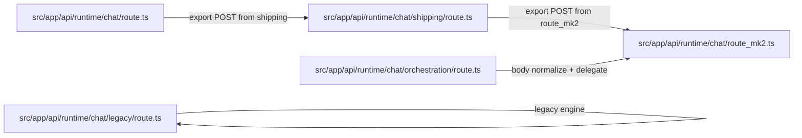
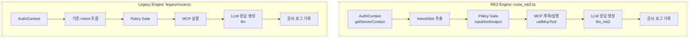
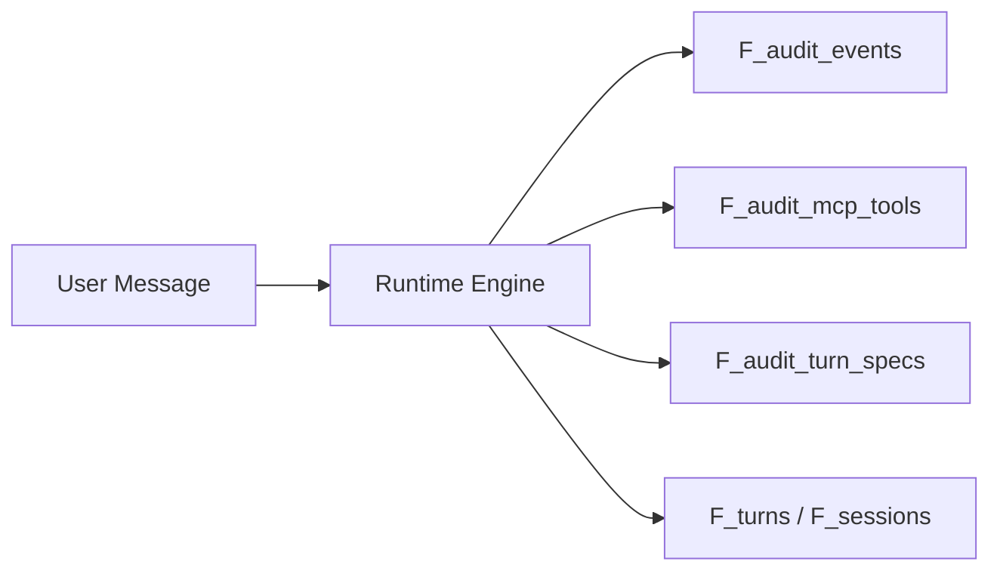

# Runtime 설계 현황 (도식 포함)

기준일: 2026-02-04  
기준 코드: `src/app/api/runtime/chat`, `src/app/api/labolatory/run/route.ts`

## 1) 한눈에 보는 라우팅 구조

```mermaid
flowchart TD
    A[UI: Labolatory] --> B[/api/labolatory/run]
    B -->|route=legacy| C[/api/runtime/chat/legacy]
    B -->|route=shipping| D[/api/runtime/chat/shipping]
    B -->|route=orchestration| E[/api/runtime/chat/orchestration]

    D --> F[chat/route_mk2.ts]
    E --> F
    C --> G[chat/legacy/route.ts]

    H[/api/runtime/chat] --> D
```

핵심 포인트
- `shipping`과 `orchestration`은 **동일 엔진(`route_mk2.ts`)**을 사용.
- `/api/runtime/chat` 기본 진입도 `shipping`으로 연결됨.
- `legacy`만 별도 엔진(`legacy/route.ts`)으로 유지됨.

---

## 2) 실제 파일 위임 관계



참고 파일
- `src/app/api/runtime/chat/route.ts`
- `src/app/api/runtime/chat/shipping/route.ts`
- `src/app/api/runtime/chat/orchestration/route.ts`
- `src/app/api/runtime/chat/legacy/route.ts`
- `src/app/api/labolatory/run/route.ts`

---

## 3) 엔진별 내부 구조 비교



요약 비교
- MK2: 상태/정책/오염 감지 이벤트가 더 촘촘하고 도메인 분기(배송/환불/재입고)가 강화됨.
- Legacy: 기존 guided/natural 흐름 유지, 상대적으로 단순한 파이프라인.

---

## 4) 로깅/감사 데이터 흐름



주요 이벤트(특히 MK2)
- `SLOT_EXTRACTED`
- `PRE_MCP_DECISION`
- `MCP_CALL_SKIPPED`
- `MCP_TOOL_FAILED`
- `FINAL_ANSWER_READY`
- `CONTEXT_CONTAMINATION_DETECTED`

---

## 5) 실험실(Labolatory) 선택지와 실제 매핑

```mermaid
flowchart TD
    A[Runtime 선택 UI\nlegacy/shipping/orchestration] --> B[/api/labolatory/run]
    B --> C{normalizeRoute}
    C -->|legacy| D[/api/runtime/chat/legacy]
    C -->|shipping| E[/api/runtime/chat/shipping]
    C -->|orchestration| F[/api/runtime/chat/orchestration]
    C -->|기타/빈값| E
```

설정 포인트
- UI 옵션은 `legacy`, `shipping`, `orchestration` 3개.
- 미지정/알 수 없는 route는 `shipping`으로 폴백.

---

## 6) 현재 설계 상태 결론

1. 운영상 **실질 메인 엔진은 MK2(`route_mk2.ts`)**.
2. `orchestration`은 독립 엔진이 아니라 MK2 위임 래퍼.
3. `legacy`는 비교/호환 목적의 별도 엔진으로 공존.
4. 문서와 코드 간 일부 표기 불일치 가능성 있음(예: `/api/runtime/chat`의 현재 실제 연결은 shipping).

